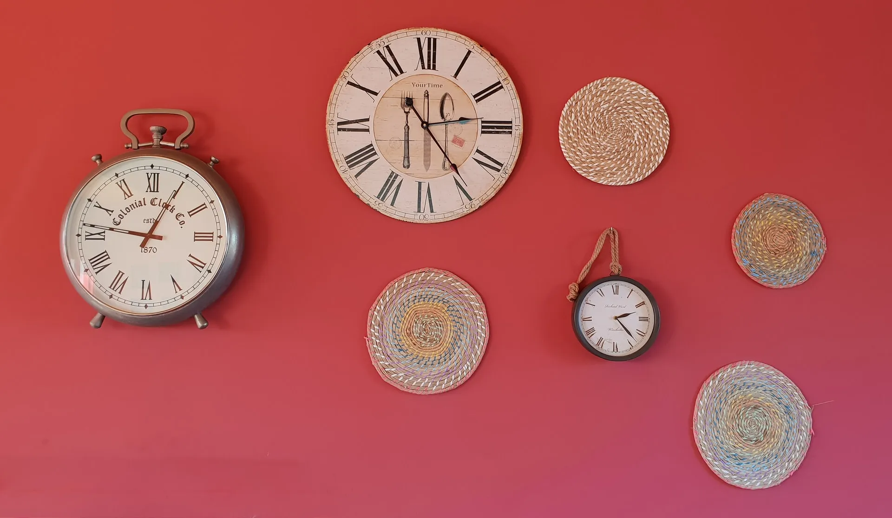

Did you imagine how to build your own business? I always do. The reason most of the time is financial freedom. Currently, I work for more or less 12 hours per day. I calculated that I could retire before my 40s with this number of hours.

I am now 28 years old, and I feel as though I wasted my twenties. It seems too late to create something now. However, I still hope to build something I can be proud of.

But having hope is not enough. I need to work hard and smartly.

So, I will start my own business. Fortunately, the internet makes it easier to earn passive income. I can create content for the web, such as a YouTube channel or write articles. It isn’t as simple as it appears, but I believe I can build something with a bit of effort.

I will begin by writing articles as it only requires a computer with internet access and a few ideas. I intend to discuss my job, which is software development. I hope to avoid making it dull, as software is a subject that can be complex and difficult to capture people’s attention.

This is my first article here, and I would like to share my progress. It’s difficult to maintain motivation, and I believe that writing it down could enhance the likelihood of not procrastinating on my dreams. Thank you so much for reading this article.

Here are my social media accounts if you'd like to follow me:

Twitter: [https://twitter.com/Falconiererb](https://twitter.com/Falconiererb)

Instagram: [https://www.instagram.com/falconiererb/](https://www.instagram.com/falconiererb/)

Linkedin: [https://www.linkedin.com/in/falconiere/](https://www.linkedin.com/in/falconiere/)

GitHub: [https://github.com/Falconiere](https://github.com/Falconiere)