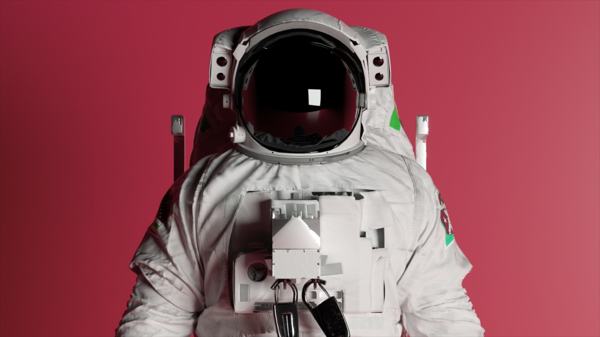

In 2024, I failed again on my New Year's resolutions, like getting rich or hitting the gym (even though I worked out a lot ), but I accomplished a few things. Let's get started.
#### My daughter
My daughter was born in June. I never imagined how being a father would change my life in so many ways. It's hard to describe the feeling I have every day. It's like falling in love again and again with the same little one. It has made me stronger, more responsible, and happier. Oh boy, it's the best feeling ever. 
#### Work and side-projects
The other good thing is that in 2024, I also fell in love with my profession. I was unmotivated and without direction, but I found my way and greatly enjoyed my job again! Thank you, my teammates. 

Also, I finally launched a project (<a href="https://codafolks.com" target="_blank">codafolks</a>, which is still in progress), started building more projects, and learned a lot. These projects were not just about work; they were about my passion. I poured my heart and soul into them, and the satisfaction I got from seeing them come to life was unparalleled. That feels so good.  
#### Knout Depression 
Well, not everything was entirely good, you guys don't know, but I was fighting against depression for so long (about 15 years), and I thought I would never win. Yup, this is a little dark subject of my life. But now, I feel confident about sharing with everyone because I am finally cured, at least temporarily. 

I know depression has cycles, and we never know when the next cycle will come. It was a long and arduous journey, filled with ups and downs, but I never gave up. I sought help, I tried different treatments, and I kept pushing forward. And now, I can proudly say that I've overcome it.  I can finally tell I am more than happier! And, of course, my wife and daughter have a huge part in this. 
#### Workout
I haven't gotten into the best shape yet but have been consistent at the gym. I have lost about 11 kilograms (75 kilograms now) and gained more muscle. I still have work to achieve my dream body, but I am close. 
#### New Home
So, by the end of 2024, we moved to a new house—a bigger house with more rooms and a beautiful view. Oh gosh, I love it! This place makes me more comfortable. I have space to be creative and achieve my goals. 
#### Continue With Good Habits
Well, 2025 is here, and I will do my best to accomplish my dreams, get all the projects from the paper and make them real. For that, I will be continuing with good habits,  so here are a couple of things I will be doing this year to achieve my goals: 

* I will continue spending quality time with my wife and daughter as much as possible (I wish I could spend much more time with them). I love them so much. ❤️
* I will continue learning to improve my professional, technical, and communication skills. 
* I will build better products and help my team to grow at my job.
* I will share more about things beyond my job. I enjoy various activities, such as playing guitar or reading sci-fi books, and I want to share that part of myself. 
* I will write more posts for my <a href="https://falconiere.io" target="_blank">website</a>.
* I will keep going to the gym and be healthier physically and mentally. 
#### Goals
Every year, I set goals to pursue, and most of the time, I fail to achieve some of them, which is fine. The important thing is that you never have to give up unless you have something impossible; that is obvious.  So, here are my goals for 2025: 

* Make a post for <a href="https://falconiere.io" target="_blank">falconiere.io</a> every two weeks.
* Make a post for <a href="https://codafolks.com" target="_blank">codafolks.com</a>  every month.
* Make at least one project profitable from <a href="https://codafolks.com" target="_blank">codafolks.com</a>.
* Monetise my <a href="https://www.youtube.com/@falconiere" target="_blank">YouTube channel</a>.
* Make one international travel. 
* Buy a new house.

I know these goals are too ambitious, but that is what moves me towards success or my definition of success.  
I could write much more about my projects and personal life in the post, but I will do it later. If you reach out, please let me know what you think. See ya ✌🏽