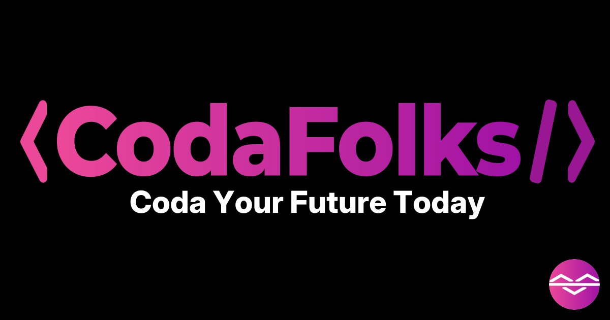

### **What is CodaFolks?**
CodaFolks started as a simple personal project—a way for me to showcase the software tools and applications I’ve built in my free time. Over time, it grew into something bigger: a platform for open-source learning, a repository of innovative ideas, and a collaborative space where developers can connect and grow.

Here’s what you can expect from CodaFolks:

- **Side Projects:** I've created a bunch of tools and software to tackle real-world issues, try out new ideas, or just for kicks!
- **Open-Source Code:** Most of the code here is open-source, so you can explore, learn from, and contribute.
- **Developer Insights:** Blogs, tutorials, and stories from my development journey—perfect for anyone looking to expand their skills or find inspiration.
- **Consulting Services:** If you envision a custom software solution, I’m here to help you realise it.
---
### **Why I Created CodaFolks**
As a developer, I know how difficult it can be to find resources that truly inspire or challenge you. I wanted to create a space that showcases my work and gives back to the developer community.

- **Learning Through Sharing:** Software is most powerful when shared. By making my projects open-source, I hope to empower others to learn, adapt, and build on my creations.
- **Building Together:** Collaboration is at the heart of coding. Whether contributing to a project or working together on consulting opportunities, CodaFolks fosters a sense of community.
---
### **What’s Next?**
CodaFolks is a work in progress, just like any good side project. Here are some of the exciting things coming your way:

- **More Projects:** I’m always working on new ideas, which I will add to the site regularly.
- **Blogs and Tutorials:** I’ll share stories, coding tips, and practical advice from my journey as a developer.
- **Collaboration Opportunities:** Got a project idea? Let’s work together and create something amazing.

---

### **Join Me on This Journey**

Whether you’re here to explore my projects, learn from the code, or collaborate on something new, I’m excited to have you join me.

Here’s how you can get started:

- <a href="https://codafolks.com/projects" target="_blank">Browse My Projects</a>: Check out the tools and applications I’ve created so far.
- <a href="https://github.com/codafolks" target="_blank">Follow Me on GitHub</a>: Dive into the code and see how it works.
- <a href="https://github.com/falconiere" target="_blank">Get in Touch</a>: Do you have a question, an idea, or feedback? I’d love to hear from you.

CodaFolks is for developers like you—people who love to create, learn, and make an impact. Let’s explore what we can build together!

---

Thank you for stopping by, and welcome to CodaFolks. Let’s make something incredible!

**Falconiere R. Barbosa**
